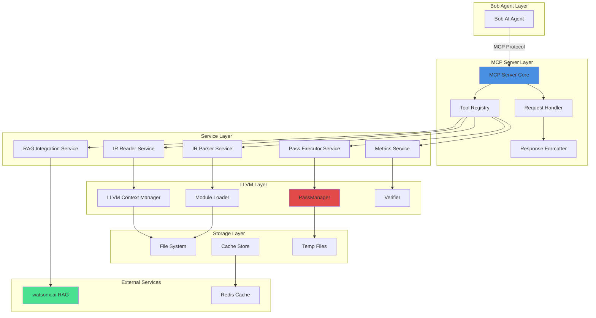

# MCP Server Architecture for Obfusi-Bob
## Detailed Technical Specification

---

## 🏗️ Architecture Overview

The MCP (Model Context Protocol) server acts as the bridge between Bob (the AI agent) and the local LLVM toolchain. It provides a set of tools that enable Bob to read, analyze, transform, and validate LLVM IR files.



---

## 📦 Project Structure

```
mcp-server/
├── src/
│   ├── index.ts                    # Server entry point
│   ├── server.ts                   # MCP server setup
│   ├── config/
│   │   ├── llvm.config.ts         # LLVM configuration
│   │   └── watsonx.config.ts      # watsonx.ai configuration
│   ├── tools/
│   │   ├── index.ts               # Tool registry
│   │   ├── read-ir-file.ts        # IR file reading tool
│   │   ├── analyze-ir.ts          # IR analysis tool
│   │   ├── execute-pass.ts        # Pass execution tool
│   │   ├── query-rag.ts           # RAG query tool
│   │   └── get-metrics.ts         # Metrics calculation tool
│   ├── services/
│   │   ├── ir-reader.service.ts   # IR file reading logic
│   │   ├── ir-parser.service.ts   # IR parsing logic
│   │   ├── pass-executor.service.ts # Pass execution logic
│   │   ├── metrics.service.ts     # Metrics calculation
│   │   └── rag.service.ts         # RAG integration
│   ├── llvm/
│   │   ├── bindings.ts            # LLVM C++ bindings
│   │   ├── context-manager.ts     # LLVM context lifecycle
│   │   ├── module-loader.ts       # Module loading/parsing
│   │   ├── verifier.ts            # IR verification
│   │   └── passes/
│   │       ├── control-flow-flattening.ts
│   │       ├── bogus-code-insertion.ts
│   │       ├── string-encryption.ts
│   │       └── multi-pass-orchestrator.ts
│   ├── utils/
│   │   ├── file-watcher.ts        # File watching with chokidar
│   │   ├── cache.ts               # Caching utilities
│   │   ├── validation.ts          # Input validation
│   │   ├── error-handler.ts       # Error handling
│   │   └── logger.ts              # Logging utilities
│   └── types/
│       ├── mcp.types.ts           # MCP protocol types
│       ├── llvm.types.ts          # LLVM-related types
│       └── obfuscation.types.ts   # Obfuscation types
├── tests/
│   ├── unit/
│   ├── integration/
│   └── fixtures/
│       └── sample-ir/
├── package.json
├── tsconfig.json
└── README.md
```

---

## 🔧 MCP Tools Specification

### 1. read_ir_file

**Purpose**: Read and parse LLVM IR files from the local filesystem.

**Input Schema**:
```typescript
interface ReadIRFileInput {
  path: string;              // Relative or absolute path to IR file
  format?: 'text' | 'bitcode'; // Default: 'text'
  validate?: boolean;        // Run verification, default: true
  cache?: boolean;           // Cache parsed result, default: true
}
```

**Output Schema**:
```typescript
interface ReadIRFileOutput {
  success: boolean;
  data?: {
    content: string;         // Raw IR content
    format: 'text' | 'bitcode';
    size: number;            // File size in bytes
    hash: string;            // SHA-256 hash for caching
    functions: string[];     // List of function names
    globals: string[];       // List of global variables
    metadata: {
      targetTriple: string;
      dataLayout: string;
      sourceFilename?: string;
    };
  };
  error?: string;
}
```

**Implementation**:
```typescript
// src/tools/read-ir-file.ts

import { Tool } from '@modelcontextprotocol/sdk/types.js';
import { IRReaderService } from '../services/ir-reader.service.js';
import { validatePath } from '../utils/validation.js';

export const readIRFileTool: Tool = {
  name: 'read_ir_file',
  description: 'Read and parse LLVM IR file from local filesystem',
  inputSchema: {
    type: 'object',
    properties: {
      path: { 
        type: 'string', 
        description: 'Path to .ll or .bc file' 
      },
      format: { 
        type: 'string', 
        enum: ['text', 'bitcode'], 
        default: 'text' 
      },
      validate: { 
        type: 'boolean', 
        default: true 
      },
      cache: { 
        type: 'boolean', 
        default: true 
      }
    },
    required: ['path']
  }
};

export async function handleReadIRFile(
  input: ReadIRFileInput
): Promise<ReadIRFileOutput> {
  try {
    // Validate path to prevent directory traversal
    const validatedPath = validatePath(input.path);
    
    // Use IR reader service
    const irReader = new IRReaderService();
    const result = await irReader.readFile(validatedPath, {
      format: input.format || 'text',
      validate: input.validate !== false,
      cache: input.cache !== false
    });
    
    return {
      success: true,
      data: result
    };
  } catch (error) {
    return {
      success: false,
      error: sanitizeError(error)
    };
  }
}
```

---

### 2. analyze_ir_structure

**Purpose**: Analyze IR structure and identify obfuscation opportunities.

**Input Schema**:
```typescript
interface AnalyzeIRInput {
  irContent?: string;        // IR content (if not using path)
  irPath?: string;           // Path to IR file
  techniques?: Array<'cfg' | 'bogus' | 'strings' | 'all'>;
  architecture?: string;     // Target architecture
}
```

**Output Schema**:
```typescript
interface AnalyzeIROutput {
  success: boolean;
  data?: {
    functions: Array<{
      name: string;
      basicBlocks: number;
      instructions: number;
      cyclomaticComplexity: number;
      opportunities: {
        controlFlowFlattening: {
          applicable: boolean;
          estimatedComplexityIncrease: number;
          reason?: string;
        };
        bogusCodeInsertion: {
          applicable: boolean;
          insertionPoints: number;
          reason?: string;
        };
        stringEncryption: {
          applicable: boolean;
          stringCount: number;
          strings: Array<{
            value: string;
            type: 'char' | 'wchar';
            length: number;
          }>;
        };
      };
    }>;
    globalStrings: number;
    totalComplexity: number;
    recommendations: string[];
  };
  error?: string;
}
```

**Implementation Strategy**:
- Parse IR into AST structure
- Traverse functions and basic blocks
- Calculate cyclomatic complexity
- Identify string literals
- Detect control flow patterns suitable for flattening
- Find insertion points for bogus code
- Generate recommendations based on analysis

---

### 3. execute_obfuscation_pass

**Purpose**: Execute LLVM obfuscation pass on IR.

**Input Schema**:
```typescript
interface ExecutePassInput {
  irPath: string;
  passName: 'flatten' | 'bogus' | 'encrypt' | 'multi-pass';
  options?: {
    // Control Flow Flattening options
    flattenLoops?: boolean;
    preserveDebugInfo?: boolean;
    
    // Bogus Code options
    bogusRatio?: number;      // 0.0 to 1.0
    opaquePredicates?: boolean;
    
    // String Encryption options
    encryptionAlgorithm?: 'aes' | 'xor' | 'custom';
    keySize?: 128 | 256;
    
    // Multi-pass options
    passes?: string[];
    maxIterations?: number;
  };
  outputPath?: string;
  dryRun?: boolean;
}
```

**Output Schema**:
```typescript
interface ExecutePassOutput {
  success: boolean;
  data?: {
    outputPath: string;
    metrics: {
      originalSize: number;
      obfuscatedSize: number;
      sizeIncrease: number;
      originalComplexity: number;
      obfuscatedComplexity: number;
      complexityIncrease: number;
      executionTime: number;
    };
    transformations: Array<{
      type: string;
      location: string;
      description: string;
    }>;
    warnings: string[];
  };
  error?: string;
}
```

**Implementation Strategy**:
- Load IR into LLVM context
- Initialize PassManager with selected pass
- Configure pass with provided options
- Execute transformation with progress callbacks
- Verify transformed IR
- Calculate metrics
- Write output to specified path
- Return detailed transformation report

---

### 4. query_rag_for_technique

**Purpose**: Query RAG system for obfuscation technique guidance.

**Input Schema**:
```typescript
interface QueryRAGInput {
  context: string;           // IR context or problem description
  technique?: string;        // Specific technique to query
  maxResults?: number;       // Default: 3
  includeCode?: boolean;     // Include code examples
}
```

**Output Schema**:
```typescript
interface QueryRAGOutput {
  success: boolean;
  data?: {
    recommendations: Array<{
      technique: string;
      description: string;
      confidence: number;
      source: {
        title: string;
        authors: string[];
        year: number;
      };
      implementation: {
        complexity: 'low' | 'medium' | 'high';
        effectiveness: number;
        overhead: string;
        codeExample?: string;
      };
    }>;
    relatedPapers: Array<{
      title: string;
      relevanceScore: number;
      summary: string;
    }>;
  };
  error?: string;
}
```

**Implementation Strategy**:
- Send query to watsonx.ai RAG endpoint
- Include IR context in query
- Retrieve relevant research paper excerpts
- Extract technique recommendations
- Calculate confidence scores
- Return citations and implementation hints

---

### 5. get_obfuscation_metrics

**Purpose**: Calculate obfuscation effectiveness metrics.

**Input Schema**:
```typescript
interface GetMetricsInput {
  originalIR: string;
  obfuscatedIR: string;
  includeDetailed?: boolean;
}
```

**Output Schema**:
```typescript
interface GetMetricsOutput {
  success: boolean;
  data?: {
    complexity: {
      original: number;
      obfuscated: number;
      increase: number;
      increasePercentage: number;
    };
    size: {
      original: number;
      obfuscated: number;
      increase: number;
      increasePercentage: number;
    };
    resilience: {
      score: number;           // 0.0 to 1.0
      factors: {
        controlFlowComplexity: number;
        dataFlowObfuscation: number;
        antiAnalysis: number;
      };
    };
    performance: {
      estimatedOverhead: number; // Percentage
      criticalPathImpact: number;
    };
    detailed?: {
      functionMetrics: Array<{
        name: string;
        originalComplexity: number;
        obfuscatedComplexity: number;
      }>;
    };
  };
  error?: string;
}
```

---

## 🔌 LLVM Integration

### LLVM Bindings Setup

```typescript
// src/llvm/bindings.ts

import { createRequire } from 'module';
const require = createRequire(import.meta.url);

// Load LLVM native bindings
const llvm = require('@llvm-bindings/core');

export interface LLVMContext {
  context: any;
  module: any;
  builder: any;
}

export class LLVMBindings {
  private static instance: LLVMBindings;
  
  private constructor() {}
  
  static getInstance(): LLVMBindings {
    if (!LLVMBindings.instance) {
      LLVMBindings.instance = new LLVMBindings();
    }
    return LLVMBindings.instance;
  }
  
  createContext(): LLVMContext {
    const context = new llvm.LLVMContext();
    const module = new llvm.Module('obfusi-bob', context);
    const builder = new llvm.IRBuilder(context);
    
    return { context, module, builder };
  }
  
  parseIRFile(path: string, context: any): any {
    const buffer = llvm.MemoryBuffer.getFile(path);
    const module = llvm.parseIR(buffer, context);
    return module;
  }
  
  verifyModule(module: any): { valid: boolean; errors: string[] } {
    const errors: string[] = [];
    const valid = llvm.verifyModule(module, (error: string) => {
      errors.push(error);
    });
    return { valid, errors };
  }
  
  writeModuleToFile(module: any, path: string): void {
    llvm.WriteBitcodeToFile(module, path);
  }
}
```

### Context Manager

```typescript
// src/llvm/context-manager.ts

export class LLVMContextManager {
  private contexts: Map<string, LLVMContext> = new Map();
  private maxContexts = 10;
  
  getOrCreateContext(id: string): LLVMContext {
    if (this.contexts.has(id)) {
      return this.contexts.get(id)!;
    }
    
    if (this.contexts.size >= this.maxContexts) {
      // Evict oldest context
      const firstKey = this.contexts.keys().next().value;
      this.destroyContext(firstKey);
    }
    
    const bindings = LLVMBindings.getInstance();
    const context = bindings.createContext();
    this.contexts.set(id, context);
    
    return context;
  }
  
  destroyContext(id: string): void {
    const context = this.contexts.get(id);
    if (context) {
      // Clean up LLVM resources
      context.context.dispose();
      this.contexts.delete(id);
    }
  }
  
  destroyAll(): void {
    for (const id of this.contexts.keys()) {
      this.destroyContext(id);
    }
  }
}
```

---

## 🚀 Server Implementation

### Main Server Setup

```typescript
// src/server.ts

import { Server } from '@modelcontextprotocol/sdk/server/index.js';
import { StdioServerTransport } from '@modelcontextprotocol/sdk/server/stdio.js';
import { 
  readIRFileTool, 
  handleReadIRFile 
} from './tools/read-ir-file.js';
// ... import other tools

export class ObfusiBobMCPServer {
  private server: Server;
  
  constructor() {
    this.server = new Server(
      {
        name: 'obfusi-bob-mcp-server',
        version: '1.0.0',
      },
      {
        capabilities: {
          tools: {},
        },
      }
    );
    
    this.setupTools();
    this.setupErrorHandling();
  }
  
  private setupTools(): void {
    // Register all tools
    this.server.setRequestHandler('tools/list', async () => ({
      tools: [
        readIRFileTool,
        analyzeIRTool,
        executePassTool,
        queryRAGTool,
        getMetricsTool
      ]
    }));
    
    // Register tool handlers
    this.server.setRequestHandler('tools/call', async (request) => {
      const { name, arguments: args } = request.params;
      
      switch (name) {
        case 'read_ir_file':
          return await handleReadIRFile(args);
        case 'analyze_ir_structure':
          return await handleAnalyzeIR(args);
        case 'execute_obfuscation_pass':
          return await handleExecutePass(args);
        case 'query_rag_for_technique':
          return await handleQueryRAG(args);
        case 'get_obfuscation_metrics':
          return await handleGetMetrics(args);
        default:
          throw new Error(`Unknown tool: ${name}`);
      }
    });
  }
  
  private setupErrorHandling(): void {
    this.server.onerror = (error) => {
      console.error('[MCP Error]', error);
    };
    
    process.on('SIGINT', async () => {
      await this.server.close();
      process.exit(0);
    });
  }
  
  async start(): Promise<void> {
    const transport = new StdioServerTransport();
    await this.server.connect(transport);
    console.log('Obfusi-Bob MCP Server running on stdio');
  }
}
```

### Entry Point

```typescript
// src/index.ts

import { ObfusiBobMCPServer } from './server.js';

async function main() {
  const server = new ObfusiBobMCPServer();
  await server.start();
}

main().catch((error) => {
  console.error('Failed to start MCP server:', error);
  process.exit(1);
});
```

---

## 📊 Caching Strategy

```typescript
// src/utils/cache.ts

import { createHash } from 'crypto';
import Redis from 'ioredis';

export class CacheManager {
  private redis: Redis;
  private memoryCache: Map<string, any> = new Map();
  private ttl = 3600; // 1 hour
  
  constructor() {
    this.redis = new Redis({
      host: process.env.REDIS_HOST || 'localhost',
      port: parseInt(process.env.REDIS_PORT || '6379')
    });
  }
  
  generateKey(data: any): string {
    const hash = createHash('sha256');
    hash.update(JSON.stringify(data));
    return hash.digest('hex');
  }
  
  async get<T>(key: string): Promise<T | null> {
    // Check memory cache first
    if (this.memoryCache.has(key)) {
      return this.memoryCache.get(key);
    }
    
    // Check Redis
    const value = await this.redis.get(key);
    if (value) {
      const parsed = JSON.parse(value);
      this.memoryCache.set(key, parsed);
      return parsed;
    }
    
    return null;
  }
  
  async set(key: string, value: any, ttl?: number): Promise<void> {
    const serialized = JSON.stringify(value);
    
    // Store in memory cache
    this.memoryCache.set(key, value);
    
    // Store in Redis with TTL
    await this.redis.setex(key, ttl || this.ttl, serialized);
  }
  
  async invalidate(pattern: string): Promise<void> {
    const keys = await this.redis.keys(pattern);
    if (keys.length > 0) {
      await this.redis.del(...keys);
    }
    
    // Clear memory cache
    for (const key of this.memoryCache.keys()) {
      if (key.match(pattern)) {
        this.memoryCache.delete(key);
      }
    }
  }
}
```

---

## 🔒 Security Implementation

### Path Validation

```typescript
// src/utils/validation.ts

import path from 'path';
import fs from 'fs';

export function validatePath(inputPath: string): string {
  // Resolve to absolute path
  const absolutePath = path.resolve(inputPath);
  
  // Get workspace root
  const workspaceRoot = process.cwd();
  
  // Check if path is within workspace
  const relativePath = path.relative(workspaceRoot, absolutePath);
  
  if (relativePath.startsWith('..') || path.isAbsolute(relativePath)) {
    throw new Error('Path traversal detected: path must be within workspace');
  }
  
  // Check if file exists
  if (!fs.existsSync(absolutePath)) {
    throw new Error(`File not found: ${inputPath}`);
  }
  
  // Check file size (max 100MB)
  const stats = fs.statSync(absolutePath);
  if (stats.size > 100 * 1024 * 1024) {
    throw new Error('File too large: maximum size is 100MB');
  }
  
  return absolutePath;
}

export function sanitizeError(error: any): string {
  // Remove sensitive information from error messages
  const message = error.message || 'Unknown error';
  
  // Remove file paths
  const sanitized = message.replace(/\/[^\s]+/g, '[PATH]');
  
  // Remove internal details
  return sanitized.replace(/at .+/g, '');
}
```

---

## 📈 Performance Optimization

### Streaming for Large Files

```typescript
// src/services/ir-reader.service.ts

import fs from 'fs';
import { createReadStream } from 'fs';
import { pipeline } from 'stream/promises';

export class IRReaderService {
  async readFile(path: string, options: any): Promise<any> {
    const stats = fs.statSync(path);
    
    if (stats.size > 10 * 1024 * 1024) {
      // Use streaming for files > 10MB
      return await this.readFileStreaming(path, options);
    } else {
      // Read entire file for smaller files
      return await this.readFileSync(path, options);
    }
  }
  
  private async readFileStreaming(path: string, options: any): Promise<any> {
    const chunks: Buffer[] = [];
    const stream = createReadStream(path, { highWaterMark: 1024 * 1024 });
    
    for await (const chunk of stream) {
      chunks.push(chunk);
      
      // Emit progress event
      const progress = chunks.reduce((sum, c) => sum + c.length, 0);
      this.emitProgress(progress, stats.size);
    }
    
    const content = Buffer.concat(chunks).toString('utf-8');
    return this.parseIR(content, options);
  }
  
  private emitProgress(current: number, total: number): void {
    const percentage = (current / total) * 100;
    console.log(`Reading IR file: ${percentage.toFixed(1)}%`);
  }
}
```

---

## 🧪 Testing Strategy

### Unit Test Example

```typescript
// tests/unit/tools/read-ir-file.test.ts

import { describe, it, expect, beforeEach } from 'vitest';
import { handleReadIRFile } from '../../../src/tools/read-ir-file';
import path from 'path';

describe('read_ir_file tool', () => {
  const fixturesDir = path.join(__dirname, '../../fixtures/sample-ir');
  
  it('should read text IR file successfully', async () => {
    const result = await handleReadIRFile({
      path: path.join(fixturesDir, 'simple.ll'),
      format: 'text',
      validate: true
    });
    
    expect(result.success).toBe(true);
    expect(result.data).toBeDefined();
    expect(result.data?.functions).toContain('main');
  });
  
  it('should reject path traversal attempts', async () => {
    const result = await handleReadIRFile({
      path: '../../../etc/passwd'
    });
    
    expect(result.success).toBe(false);
    expect(result.error).toContain('Path traversal detected');
  });
  
  it('should handle large files with streaming', async () => {
    // Test with 15MB file
    const result = await handleReadIRFile({
      path: path.join(fixturesDir, 'large.ll')
    });
    
    expect(result.success).toBe(true);
  });
});
```

---

## 📝 Configuration

### package.json

```json
{
  "name": "obfusi-bob-mcp-server",
  "version": "1.0.0",
  "type": "module",
  "main": "dist/index.js",
  "scripts": {
    "build": "tsc",
    "start": "node dist/index.js",
    "dev": "tsx watch src/index.ts",
    "test": "vitest",
    "test:integration": "vitest run --config vitest.integration.config.ts"
  },
  "dependencies": {
    "@modelcontextprotocol/sdk": "^0.5.0",
    "@llvm-bindings/core": "^18.0.0",
    "chokidar": "^3.5.3",
    "ioredis": "^5.3.2",
    "ws": "^8.16.0"
  },
  "devDependencies": {
    "@types/node": "^20.11.0",
    "@types/ws": "^8.5.10",
    "tsx": "^4.7.0",
    "typescript": "^5.3.3",
    "vitest": "^1.2.0"
  }
}
```

### tsconfig.json

```json
{
  "compilerOptions": {
    "target": "ES2022",
    "module": "ES2022",
    "moduleResolution": "node",
    "outDir": "./dist",
    "rootDir": "./src",
    "strict": true,
    "esModuleInterop": true,
    "skipLibCheck": true,
    "forceConsistentCasingInFileNames": true,
    "resolveJsonModule": true,
    "declaration": true,
    "declarationMap": true,
    "sourceMap": true
  },
  "include": ["src/**/*"],
  "exclude": ["node_modules", "dist", "tests"]
}
```

---

## 🚀 Deployment Checklist

- [ ] Install Node.js ≥18
- [ ] Install LLVM 18+ development headers
- [ ] Install Redis for caching
- [ ] Configure watsonx.ai credentials
- [ ] Build TypeScript project
- [ ] Run unit tests
- [ ] Run integration tests
- [ ] Start MCP server
- [ ] Verify Bob can connect
- [ ] Test all tools
- [ ] Monitor performance
- [ ] Set up logging
- [ ] Configure error alerting

---

## 📚 Next Steps

1. Implement core MCP server structure
2. Create LLVM bindings wrapper
3. Implement each tool handler
4. Add comprehensive error handling
5. Implement caching layer
6. Create test suite
7. Integrate with watsonx.ai RAG
8. Performance optimization
9. Documentation
10. Deployment

This architecture provides a solid foundation for the Obfusi-Bob MCP server that bridges Bob to the LLVM toolchain effectively!