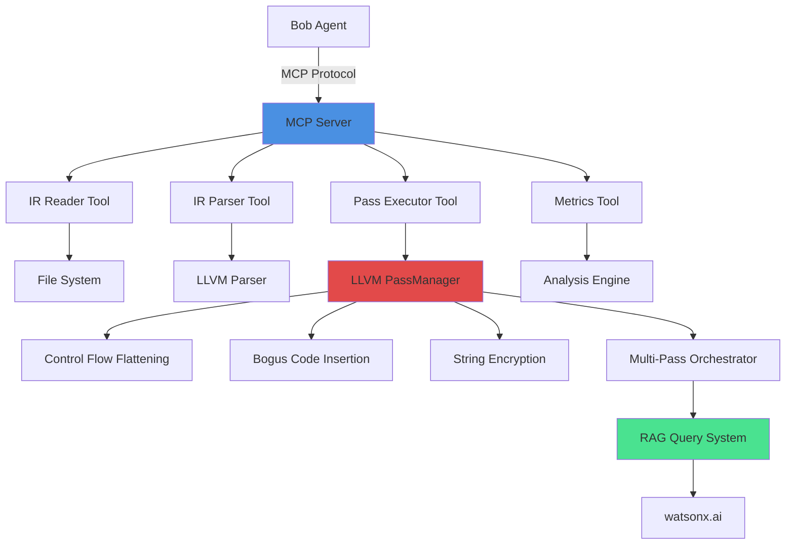
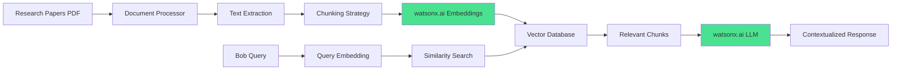

# Obfusi-Bob: LLVM-Based Object File Obfuscation Framework
## IBM Bob Dev Day Hackathon - Project Initialization Plan

**Mission**: Turn idea into impact faster by creating an agentic tool for automated software IP protection through code transformations.

---

## 📋 Project Overview

### Tech Stack
- **Agentic AI**: watsonx Orchestrate
- **RAG System**: watsonx.ai
- **MCP Integration**: Bridge Bob to local LLVM toolchain
- **LLVM**: Latest version (18+), multi-architecture support
- **Frontend**: Tailwind CSS + GSAP for visualization dashboard

### Core Obfuscation Techniques
1. Control Flow Flattening
2. Bogus Code Insertion
3. String Encryption
4. Multi-Pass Obfuscation Cycles

---

## 🏗️ Recommended Project Structure

```
obfusi-bob/
├── .bob/
│   ├── rules-code/
│   │   └── AGENTS.md          # Code mode specific rules
│   ├── rules-advanced/
│   │   └── AGENTS.md          # Advanced mode rules
│   ├── rules-ask/
│   │   └── AGENTS.md          # Documentation mode rules
│   └── rules-plan/
│       └── AGENTS.md          # Planning mode rules
├── .bobrules                   # Main project rules file
├── AGENTS.md                   # General agent guidance
├── mcp-server/
│   ├── src/
│   │   ├── index.ts           # MCP server entry point
│   │   ├── tools/
│   │   │   ├── ir-reader.ts   # Read LLVM IR files
│   │   │   ├── ir-parser.ts   # Parse IR structure
│   │   │   └── pass-executor.ts # Execute LLVM passes
│   │   ├── llvm/
│   │   │   ├── bindings.ts    # LLVM C++ bindings
│   │   │   └── passes/
│   │   │       ├── control-flow-flattening.ts
│   │   │       ├── bogus-code-insertion.ts
│   │   │       ├── string-encryption.ts
│   │   │       └── multi-pass-orchestrator.ts
│   │   └── utils/
│   │       ├── file-watcher.ts
│   │       └── validation.ts
│   ├── package.json
│   └── tsconfig.json
├── rag-system/
│   ├── papers/                 # Research papers storage
│   ├── embeddings/             # Vector embeddings
│   ├── ingest.py              # Paper ingestion pipeline
│   ├── query.py               # RAG query interface
│   └── config.yaml            # watsonx.ai configuration
├── llvm-passes/
│   ├── CMakeLists.txt
│   ├── include/
│   │   └── ObfusiBob/
│   │       ├── ControlFlowFlattening.h
│   │       ├── BogusCodeInsertion.h
│   │       ├── StringEncryption.h
│   │       └── MultiPassManager.h
│   └── lib/
│       ├── ControlFlowFlattening.cpp
│       ├── BogusCodeInsertion.cpp
│       ├── StringEncryption.cpp
│       └── MultiPassManager.cpp
├── dashboard/
│   ├── src/
│   │   ├── components/
│   │   │   ├── ObfuscationVisualizer.tsx
│   │   │   ├── PassSelector.tsx
│   │   │   └── MetricsDisplay.tsx
│   │   ├── animations/
│   │   │   └── gsap-effects.ts
│   │   └── App.tsx
│   ├── tailwind.config.js
│   └── package.json
├── tests/
│   ├── ir-samples/            # Sample IR files for testing
│   ├── unit/
│   └── integration/
└── docs/
    ├── architecture.md
    ├── mcp-integration.md
    └── obfuscation-techniques.md
```

---

## 🔐 Step 1: .bobrules File - Security & Compiler Rules

### Critical Rules for High-Quality Security Code

```yaml
# .bobrules - Obfusi-Bob Project Rules

project:
  name: "Obfusi-Bob"
  type: "security-compiler-framework"
  hackathon: "IBM Bob Dev Day"
  
security:
  priority: "critical"
  rules:
    - "All LLVM IR transformations MUST preserve program semantics"
    - "Obfuscation passes MUST NOT introduce exploitable vulnerabilities"
    - "String encryption keys MUST use cryptographically secure random generation"
    - "Control flow modifications MUST maintain exception handling integrity"
    - "All file operations MUST validate paths to prevent directory traversal"
    - "MCP server MUST sanitize all user inputs before LLVM operations"
    - "Never expose internal IR structure details in error messages"
    - "All temporary files MUST be securely deleted after processing"

compiler:
  llvm_version: "18+"
  architectures: ["x86_64", "aarch64", "arm"]
  optimization_levels: ["O0", "O1", "O2", "O3"]
  rules:
    - "Always verify IR validity before and after transformations"
    - "Use LLVM's PassManager for all transformation orchestration"
    - "Preserve debug information when possible for reversibility"
    - "Test obfuscation at all optimization levels"
    - "Ensure passes are architecture-agnostic unless explicitly targeted"
    - "Use LLVM's built-in verification passes after each transformation"
    - "Document complexity metrics for each obfuscation technique"

code_quality:
  rules:
    - "All LLVM pass code MUST include comprehensive unit tests"
    - "MCP tools MUST have error handling for malformed IR files"
    - "Use TypeScript strict mode for all MCP server code"
    - "Document time/space complexity for each obfuscation pass"
    - "Include rollback mechanisms for failed transformations"
    - "Log all transformation decisions for audit trail"
    - "Validate IR structure before applying multi-pass cycles"

mcp_integration:
  rules:
    - "MCP tools MUST timeout after 30 seconds for long operations"
    - "Always return structured error responses with context"
    - "Cache parsed IR structures to avoid redundant parsing"
    - "Implement file watching for automatic IR reload"
    - "Provide progress callbacks for long-running passes"
    - "Support batch processing of multiple IR files"

rag_system:
  rules:
    - "Embed research papers with metadata (technique, complexity, effectiveness)"
    - "Query RAG before applying novel transformation patterns"
    - "Cache RAG responses for identical transformation contexts"
    - "Include paper citations in transformation decision logs"
    - "Update embeddings when new obfuscation research is added"

testing:
  rules:
    - "Test each obfuscation technique in isolation first"
    - "Verify obfuscated binaries execute identically to originals"
    - "Measure obfuscation effectiveness with standard metrics"
    - "Test multi-pass combinations for semantic preservation"
    - "Include adversarial deobfuscation tests"
    - "Benchmark performance overhead of each technique"

dashboard:
  rules:
    - "Visualize IR transformation graph with GSAP animations"
    - "Show real-time metrics: complexity increase, execution overhead"
    - "Display RAG-suggested transformations with confidence scores"
    - "Provide before/after IR diff view"
    - "Include export functionality for obfuscation reports"
```

---

## 🔧 Step 2: MCP Server Architecture for LLVM IR Reading

### MCP Server Design



### MCP Tools Specification

#### 1. **read_ir_file**
```typescript
{
  name: "read_ir_file",
  description: "Read and parse LLVM IR file from local filesystem",
  inputSchema: {
    type: "object",
    properties: {
      path: { type: "string", description: "Path to .ll or .bc file" },
      format: { type: "string", enum: ["text", "bitcode"], default: "text" },
      validate: { type: "boolean", default: true }
    },
    required: ["path"]
  }
}
```

**Implementation Strategy**:
- Use Node.js `fs` module for file reading
- Integrate LLVM's `llvm-dis` for bitcode to text conversion
- Parse IR structure into JSON representation
- Validate IR using LLVM's verification passes
- Return structured data: functions, basic blocks, instructions

#### 2. **analyze_ir_structure**
```typescript
{
  name: "analyze_ir_structure",
  description: "Analyze IR structure and identify obfuscation opportunities",
  inputSchema: {
    type: "object",
    properties: {
      ir_content: { type: "string", description: "IR file content" },
      techniques: { 
        type: "array", 
        items: { enum: ["cfg", "bogus", "strings", "all"] }
      }
    },
    required: ["ir_content"]
  }
}
```

**Implementation Strategy**:
- Parse control flow graph (CFG) structure
- Identify string literals for encryption
- Detect basic blocks suitable for flattening
- Calculate complexity metrics (cyclomatic complexity)
- Return analysis report with recommendations

#### 3. **execute_obfuscation_pass**
```typescript
{
  name: "execute_obfuscation_pass",
  description: "Execute LLVM obfuscation pass on IR",
  inputSchema: {
    type: "object",
    properties: {
      ir_path: { type: "string" },
      pass_name: { 
        type: "string", 
        enum: ["flatten", "bogus", "encrypt", "multi-pass"] 
      },
      options: { type: "object" },
      output_path: { type: "string" }
    },
    required: ["ir_path", "pass_name"]
  }
}
```

**Implementation Strategy**:
- Load IR into LLVM context
- Initialize PassManager with selected pass
- Execute transformation with progress callbacks
- Verify transformed IR
- Write output to specified path
- Return transformation metrics

#### 4. **query_rag_for_technique**
```typescript
{
  name: "query_rag_for_technique",
  description: "Query RAG system for obfuscation technique guidance",
  inputSchema: {
    type: "object",
    properties: {
      context: { type: "string", description: "IR context or problem" },
      technique: { type: "string" },
      max_results: { type: "number", default: 3 }
    },
    required: ["context"]
  }
}
```

**Implementation Strategy**:
- Send query to watsonx.ai RAG endpoint
- Retrieve relevant research paper excerpts
- Extract technique recommendations
- Return citations and confidence scores

#### 5. **get_obfuscation_metrics**
```typescript
{
  name: "get_obfuscation_metrics",
  description: "Calculate obfuscation effectiveness metrics",
  inputSchema: {
    type: "object",
    properties: {
      original_ir: { type: "string" },
      obfuscated_ir: { type: "string" }
    },
    required: ["original_ir", "obfuscated_ir"]
  }
}
```

**Implementation Strategy**:
- Calculate complexity increase (cyclomatic, cognitive)
- Measure code size increase
- Estimate execution overhead
- Compute resilience score
- Return comprehensive metrics report

### MCP Server Implementation Checklist

- [ ] Set up TypeScript project with MCP SDK
- [ ] Implement LLVM C++ bindings using N-API or FFI
- [ ] Create IR file reader with validation
- [ ] Build IR parser for structure extraction
- [ ] Implement pass executor with progress tracking
- [ ] Integrate watsonx.ai RAG client
- [ ] Add comprehensive error handling
- [ ] Create unit tests for each tool
- [ ] Document MCP protocol usage
- [ ] Add file watching for auto-reload

---

## 📚 Step 3: RAG Strategy for Research Paper Ingestion

### Recommended Research Papers

#### Core Obfuscation Papers
1. **Control Flow Flattening**
   - "Obfuscating C++ Programs via Control Flow Flattening" (Chenxi Wang et al.)
   - "A Generic Approach to Automatic Deobfuscation of Executable Code" (Udupa et al.)

2. **Bogus Code Insertion**
   - "Manufacturing Cheap, Resilient, and Stealthy Opaque Constructs" (Collberg et al.)
   - "Opaque Predicates Detection by Abstract Interpretation" (Dalla Preda et al.)

3. **String Encryption**
   - "String Obfuscation Techniques" (Ceccato et al.)
   - "Protecting Software through Obfuscation: Can It Keep Pace with Progress in Code Analysis?" (Schrittwieser et al.)

4. **Multi-Pass & Hybrid Techniques**
   - "SoK: Cryptographically Protected Database Search" (Fuller et al.)
   - "Layered Obfuscation: A Taxonomy of Software Obfuscation Techniques for Layered Security" (Banescu et al.)

5. **LLVM-Specific**
   - "Obfuscator-LLVM: Software Protection for the Masses" (Junod et al.)
   - "LLVM-Based Hybrid Fuzzing with LibKluzzer" (Chen et al.)

### RAG System Architecture



### RAG Implementation Strategy

#### Phase 1: Document Ingestion
```python
# rag-system/ingest.py

import watsonx_ai
from langchain.text_splitter import RecursiveCharacterTextSplitter
from langchain.document_loaders import PyPDFLoader

class ObfuscationPaperIngestor:
    def __init__(self, watsonx_credentials):
        self.embeddings = watsonx_ai.Embeddings(credentials)
        self.vector_store = ChromaDB("obfusi-bob-papers")
        
    def ingest_paper(self, pdf_path, metadata):
        # Load PDF
        loader = PyPDFLoader(pdf_path)
        documents = loader.load()
        
        # Chunk with overlap for context preservation
        splitter = RecursiveCharacterTextSplitter(
            chunk_size=1000,
            chunk_overlap=200,
            separators=["\n\n", "\n", ". ", " "]
        )
        chunks = splitter.split_documents(documents)
        
        # Add metadata
        for chunk in chunks:
            chunk.metadata.update({
                "technique": metadata["technique"],
                "complexity": metadata["complexity"],
                "effectiveness": metadata["effectiveness"],
                "llvm_compatible": metadata["llvm_compatible"]
            })
        
        # Generate embeddings and store
        self.vector_store.add_documents(chunks, self.embeddings)
```

#### Phase 2: Query Strategy
```python
# rag-system/query.py

class ObfuscationRAG:
    def query_technique(self, ir_context, technique_type):
        # Create contextual query
        query = f"""
        Given this LLVM IR context:
        {ir_context}
        
        Recommend {technique_type} obfuscation approach.
        Consider: semantic preservation, complexity increase, resilience.
        """
        
        # Retrieve relevant chunks
        results = self.vector_store.similarity_search(
            query,
            k=5,
            filter={"technique": technique_type}
        )
        
        # Generate response with watsonx.ai
        response = watsonx_ai.generate(
            prompt=self.build_prompt(query, results),
            model="ibm/granite-13b-chat-v2",
            parameters={
                "max_new_tokens": 500,
                "temperature": 0.3
            }
        )
        
        return {
            "recommendation": response,
            "sources": [r.metadata for r in results],
            "confidence": self.calculate_confidence(results)
        }
```

#### Phase 3: Metadata Schema
```yaml
paper_metadata:
  title: "Paper title"
  authors: ["Author 1", "Author 2"]
  year: 2024
  technique: "control_flow_flattening"  # or bogus_code, string_encryption, multi_pass
  complexity: "high"  # low, medium, high
  effectiveness: 0.85  # 0.0 to 1.0
  llvm_compatible: true
  implementation_difficulty: "medium"
  performance_overhead: "15%"
  resilience_score: 0.78
  tags: ["cfg", "static-analysis-resistant", "llvm"]
```

### RAG Integration with MCP

```typescript
// mcp-server/src/tools/rag-integration.ts

async function queryRAGForTransformation(
  irContext: string,
  technique: ObfuscationTechnique
): Promise<RAGResponse> {
  const response = await fetch('http://rag-system:8000/query', {
    method: 'POST',
    body: JSON.stringify({
      context: irContext,
      technique: technique,
      max_results: 3
    })
  });
  
  const data = await response.json();
  
  return {
    recommendation: data.recommendation,
    papers: data.sources,
    confidence: data.confidence,
    implementation_hints: extractImplementationHints(data)
  };
}
```

### RAG Optimization Strategies

1. **Chunking Strategy**
   - Use semantic chunking based on paper sections
   - Preserve code examples as complete chunks
   - Include algorithm pseudocode in metadata

2. **Embedding Model Selection**
   - Use watsonx.ai's domain-specific embeddings
   - Fine-tune on security/compiler terminology
   - Test retrieval quality with benchmark queries

3. **Query Enhancement**
   - Include IR structure in query context
   - Add architecture-specific constraints
   - Incorporate previous transformation history

4. **Caching Strategy**
   - Cache frequent queries (e.g., "flatten simple loop")
   - Store transformation patterns for reuse
   - Invalidate cache when new papers added

5. **Evaluation Metrics**
   - Measure retrieval precision/recall
   - Track transformation success rate
   - Monitor RAG response latency

---

## 🎯 Implementation Roadmap

### Phase 1: Foundation (Days 1-2)
- [ ] Initialize project structure
- [ ] Create .bobrules and AGENTS.md files
- [ ] Set up LLVM development environment
- [ ] Configure watsonx.ai credentials

### Phase 2: MCP Server (Days 3-4)
- [ ] Implement basic MCP server with TypeScript
- [ ] Create IR file reader tool
- [ ] Build IR parser and analyzer
- [ ] Add LLVM pass executor
- [ ] Test with sample IR files

### Phase 3: RAG System (Days 4-5)
- [ ] Collect and organize research papers
- [ ] Implement document ingestion pipeline
- [ ] Set up vector database
- [ ] Create query interface
- [ ] Test retrieval quality

### Phase 4: LLVM Passes (Days 5-7)
- [ ] Implement Control Flow Flattening pass
- [ ] Implement Bogus Code Insertion pass
- [ ] Implement String Encryption pass
- [ ] Create Multi-Pass Orchestrator
- [ ] Write comprehensive tests

### Phase 5: Dashboard (Days 7-8)
- [ ] Build React frontend with Tailwind CSS
- [ ] Create obfuscation visualizer with GSAP
- [ ] Implement metrics display
- [ ] Add pass selector interface
- [ ] Integrate with MCP server

### Phase 6: Integration & Demo (Days 8-9)
- [ ] Connect all components
- [ ] Create demo scenarios
- [ ] Prepare presentation materials
- [ ] Performance optimization
- [ ] Final testing

---

## 🔍 Key Success Metrics

1. **Functionality**
   - All 4 obfuscation techniques working
   - MCP server responds < 2 seconds
   - RAG retrieval accuracy > 80%

2. **Security**
   - No semantic bugs introduced
   - Passes LLVM verification
   - Resilient to basic deobfuscation

3. **Usability**
   - Dashboard loads < 1 second
   - Clear visualization of transformations
   - Intuitive pass selection

4. **Innovation**
   - RAG-guided transformation decisions
   - Agentic workflow automation
   - Real-time obfuscation feedback

---

## 📝 Next Steps

1. **Review this plan** and provide feedback
2. **Approve .bobrules content** or suggest modifications
3. **Switch to Code mode** to begin implementation
4. **Start with MCP server** as the critical integration point

Would you like me to proceed with creating the actual .bobrules and AGENTS.md files, or would you like to modify any aspect of this plan first?